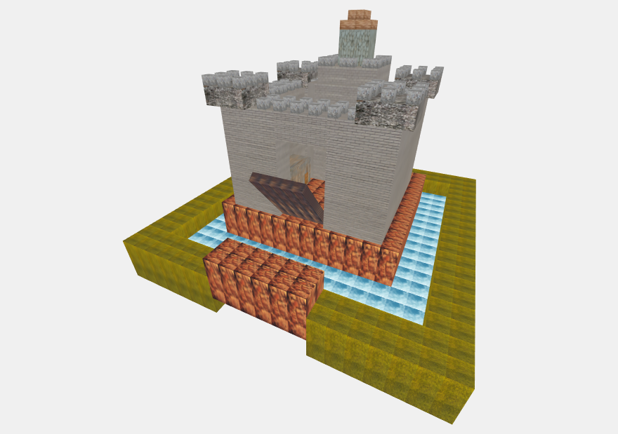
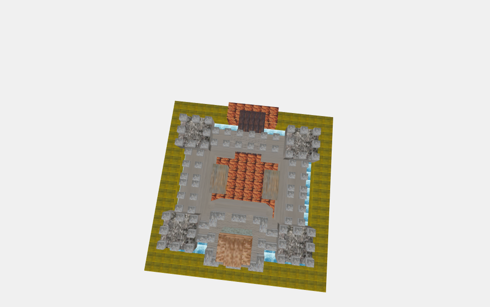

# Project Working with Cubes
## Qoob Castle

The scene depicts a fort containing two warehouses standing atop an height and surrounded by a ditch filled with water, that constantly lifts and lowers its drawbridge.

###### The castle seen from the front

###### The castle seen from above

The code is all contained in the "Quoob_Castle.html" file, and it uses libraries and textures present in the "Lib" and "Textures" folders.

The terrain is generated by reading the "heightmap3.jpg" file in the Textures folder.

The main structure is built half at a time with a function, then the wall and tower merlons are placed with apposite functions.

